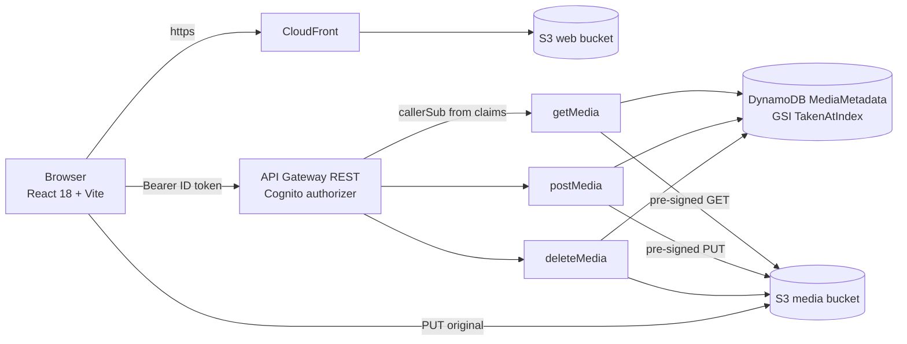

# Vault

**A private photo and video cloud for one family.** Upload originals straight to S3 from the browser, and browse them the way Photos does: by the day they were taken, with year and month zoom levels and a scrubber that jumps a decade in one drag. Built for a library of tens of thousands of items.

## Features

- Timeline grouped by capture date, with Years / Months / All zoom levels and a date scrubber
- Row-level virtualisation: around 200 images in the DOM no matter how deep you scroll
- Capture date, camera and GPS read from EXIF **in the browser** before upload, so a photo lands in the right month immediately
- Direct-to-S3 uploads with pre-signed URLs (originals never pass through a server)
- Multi-select with per-month "select all" and a confirm dialog that counts what you are about to delete
- Cognito sign-in via Amplify UI; every API call is bound to the caller's identity server-side

## Architecture



## Notable engineering

- **The capture-date model.** Every item carries `takenAt` whose naive part is always the *local wall clock* the shutter fired at, plus a sortable `takenAtKey` (`YYYYMMDDTHHMMSS#hash`) used as the sort key of a sparse GSI. Grouping by wall-clock date, not instant, is what makes a 23:30 photo in Kyiv land on the right day. Details in [`backend/README.md`](backend/README.md).
- **Timezone inference.** Exported libraries often have a placeholder `+00:00`. The backfill borrows the offset from a neighbouring photo taken within 48 hours and records that it did, moving a large share of items onto the correct calendar day.
- **Summary-first layout.** One `mode=summary` call returns counts per year and month, which is enough to size every section exactly before a single thumbnail loads. The scrollbar and the scrubber are therefore correct from the first frame.
- **Identity from the authorizer.** The API uses non-proxy integrations; mapping templates inject `$context.authorizer.claims.sub` and the Lambdas use nothing else as the user id.

The full design write-up is in [`docs/photo-timeline-design.md`](docs/photo-timeline-design.md), and notes on importing an existing library in [`docs/migration.md`](docs/migration.md).

## Tech stack

React 18, TypeScript, Vite, Emotion, TanStack Virtual, Recoil, AWS Amplify (auth), `exifr`; AWS Lambda (Node 20), API Gateway REST, Cognito, DynamoDB, S3, CloudFront.

## Running locally

```bash
cp .env.example .env     # Cognito pool/client ids and the API base URL
npm ci
npm run dev
npm run lint
```

## Deploying

- Frontend: `./deploy.sh` (build, sync to the web bucket, invalidate CloudFront).
- Backend: `backend/apply_role_policy.sh`, `backend/apply_api_auth.sh`, `backend/deploy_lambdas.sh`. See [`backend/README.md`](backend/README.md) for creating the table, GSI and API from scratch.

## Status and limitations

Vault is in daily use by its intended handful of people. Known gaps: no server-side thumbnail generation for new uploads (videos fall back to the original), and neither S3 versioning nor DynamoDB point-in-time recovery is enabled yet, so a confirmed delete is final.

## License

MIT. See [LICENSE](LICENSE).
